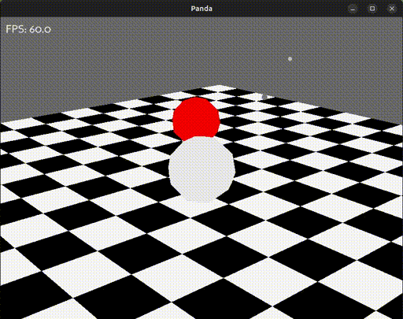
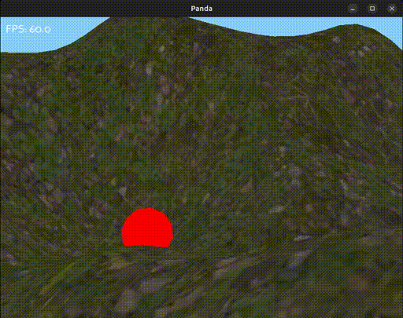

# minimal-game-engine

Minimal voxel engine with breakable physics, written in python.

## Instructions

### Prerequisites

* git - to checkout this repo
* python 3.10 and pip - to run the program and install dependencies

### Install

* clone this repo
* install dependencies: `pip install -r requirements.txt`

### How to run

* Run it like so in the terminal: `python game_engine.py` for a procedurally generated world experience.

### Controls

Use the keys `a`,`s`,`d`,`w` to steer the position of the camera and use the mouse to steer the angle of the camera.

## Demo
### Collision physics:

### Gravity:

### Multi-collision physics:

### Procedural generated terrain:

### Place blocks:
